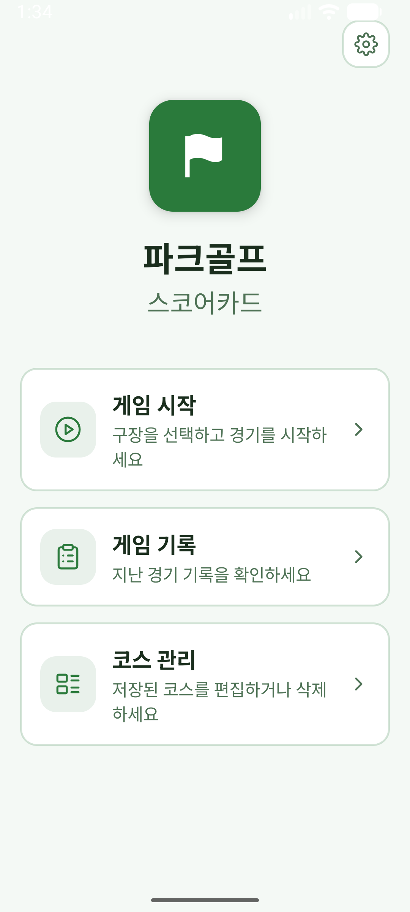
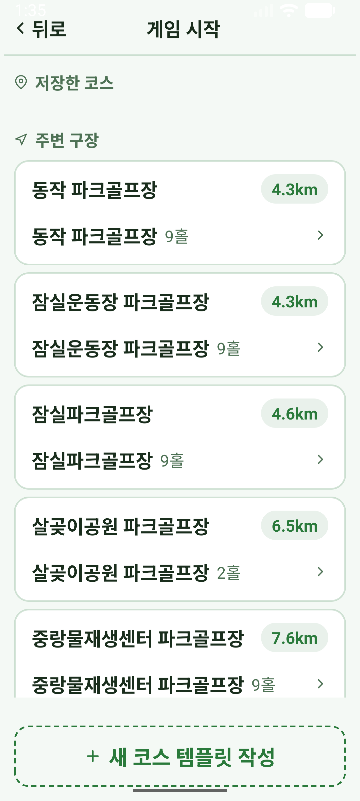
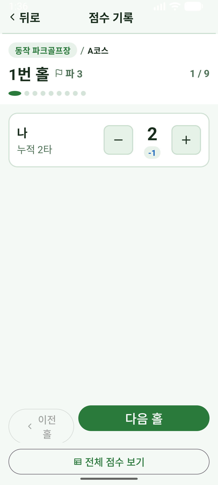
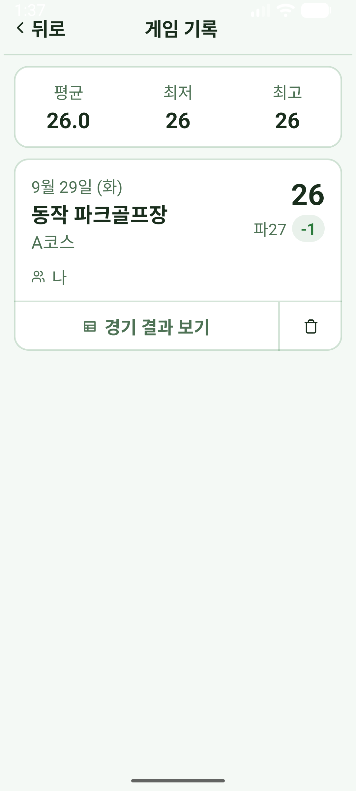
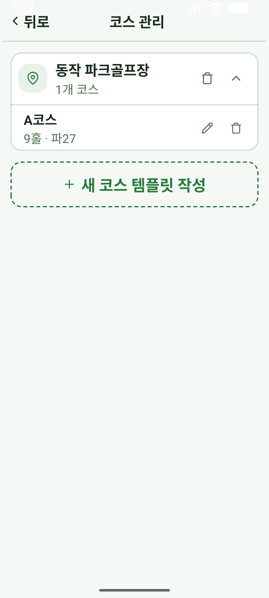
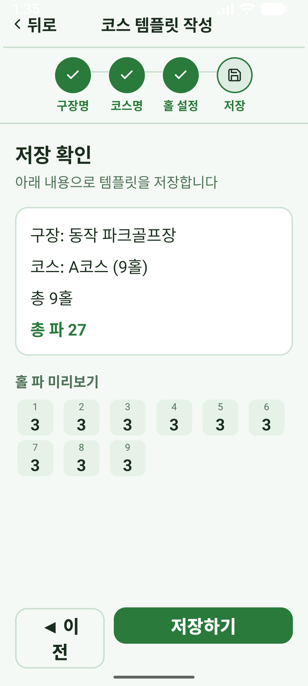
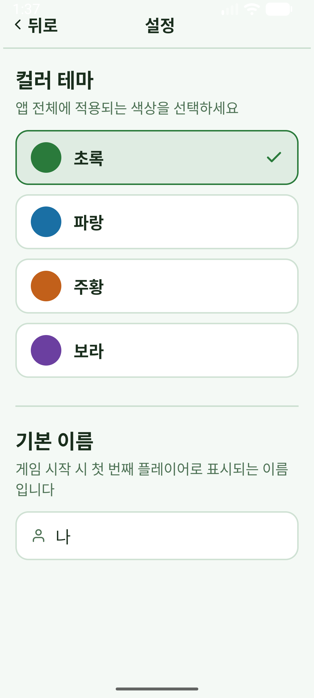

# 파크골프 스코어카드 (Parkgolf Scorecard)

시니어 친화적인 **오프라인 우선** 파크골프 점수 기록 안드로이드 앱. 큰 글씨·단순한 흐름으로 경기 중 점수를 쉽게 기록하고, 지난 기록과 코스를 관리하며, 위치 기반으로 주변 파크골프장을 찾을 수 있습니다.

> 네이티브 Android · Kotlin · View(XML) + ViewBinding · MVVM · Room · Jetpack Navigation · Material. 서버 없이 기기 내에서 동작합니다.

## 스크린샷

| 홈 | 주변 구장 (거리순) | 점수 기록 | 경기 완료 |
|:---:|:---:|:---:|:---:|
|  |  |  |  |
| **게임 기록** | **코스 관리** | **코스 템플릿 마법사** | **설정 (테마)** |
|  |  |  |  |

## 주요 기능

- **게임 진행 / 점수 기록** — 홀별 파, 플레이어별 누적 타수와 파 대비(±) 표시, 여러 명 동시 기록, 전체 점수표(가로 스크롤), 경기 완료 랭킹(메달)
- **진행 중 라운드 이어하기** — 앱을 닫아도 진행 중이던 경기를 이어서 기록
- **게임 기록** — 완료 경기 목록(날짜·구장·총타수·파 대비 배지·플레이어), 최근 통계(평균/최저/최고), 상세(경기 결과 점수표)
- **코스 관리** — 구장/코스 추가·편집·삭제(단계형 템플릿 마법사, 홀별 파 설정), 확장형 구장 카드
- **주변 구장** — 기기 위치 기준 전국 파크골프장을 **거리순**으로 표시, 선택 시 코스 마법사 프리필 → 저장 후 바로 경기
- **설정** — 4가지 컬러 테마, 기본 플레이어 이름

## 개인정보 / 위치

- 위치 권한은 **"주변 구장 찾기"** 를 눌렀을 때만 사용하며, **기기 내에서 거리 계산에만** 쓰입니다.
- 위치를 포함한 어떤 데이터도 **네트워크로 전송하거나 서버에 저장하지 않습니다.** 모든 기록은 기기 로컬(Room DB)에만 저장됩니다.

## 설치 (APK)

1. [Releases](../../releases)에서 최신 `parkgolf-scorecard-vX.Y.Z.apk` 를 내려받습니다.
2. Android 설정에서 **"출처를 알 수 없는 앱 설치"** 를 허용합니다.
3. APK를 열어 설치합니다. (최소 Android 5.0 / API 21)
4. 무결성 확인이 필요하면 함께 제공되는 `.sha256` 값과 대조하세요.

## 소스 빌드

```bash
# 디버그 APK
./gradlew assembleDebug

# 단위 테스트
./gradlew testDebugUnitTest
```

`local.properties` 에 Android SDK 경로(`sdk.dir=...`)가 필요합니다(Android Studio가 자동 생성).

릴리스 서명 APK를 만들려면 `keystore.properties` 를 설정합니다(아래 "릴리스" 참고). 없으면 릴리스 빌드는 디버그 키로 서명되어 배포에는 부적합합니다.

## 데이터 출처

주변 구장 데이터는 **대한파크골프협회 「전국 파크골프장 현황(2026년 상반기)」** 자료(구장명·주소·홀수, 564건)를 기반으로 합니다. 전처리 파이프라인(`tools/build_venues.py`)이 PDF를 파싱하고, 주소를 [VWorld](https://www.vworld.kr/) 지오코딩으로 좌표 변환하여 앱 자산 `app/src/main/assets/parkgolf_venues.json`(557개 구장, 좌표 100%)을 생성합니다.

데이터 재생성:

```bash
pip install -r tools/requirements.txt
VWORLD_KEY=<발급받은_키> python3 tools/build_venues.py
```

## 릴리스 (메인테이너용)

1. 릴리스 키스토어 생성(저장소 밖, 비밀 보관):
   ```bash
   keytool -genkeypair -v -keystore parkgolf-release.jks \
     -alias parkgolf -keyalg RSA -keysize 2048 -validity 10000
   ```
2. `keystore.properties.template` 를 복사해 `keystore.properties` 로 만들고 값 채우기(이 파일은 gitignore됨).
3. 버전 상향(`app/build.gradle.kts` 의 `versionName`/`versionCode`).
4. 서명 APK 빌드 + 체크섬:
   ```bash
   ./gradlew assembleRelease
   shasum -a 256 app/build/outputs/apk/release/app-release.apk
   ```
5. 태그(`vX.Y.Z`) 푸시 후 GitHub Release에 APK와 `.sha256` 첨부.

## 아키텍처

레이어 구조·주요 흐름·데이터 파이프라인은 [docs/ARCHITECTURE.md](docs/ARCHITECTURE.md) 참고.

## 라이선스

[MIT](LICENSE) © 2026 Inhyo Hwang
